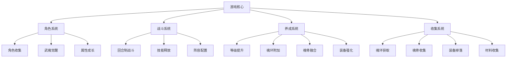
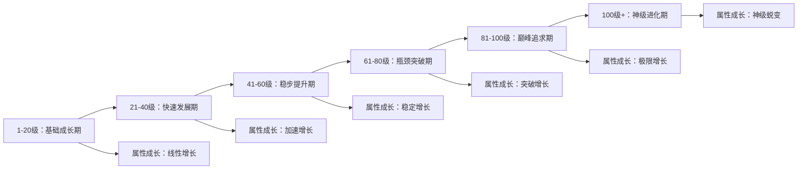
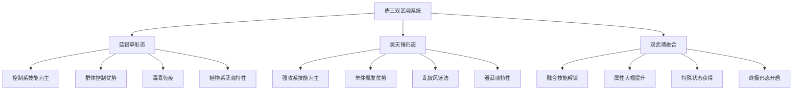
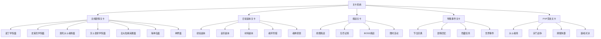
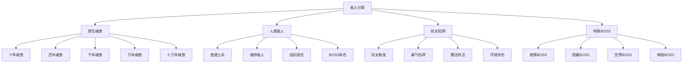
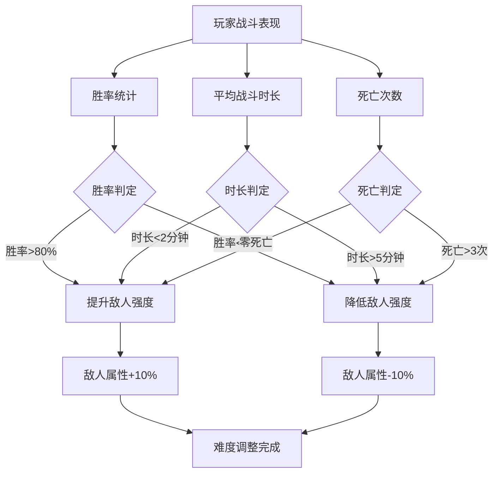
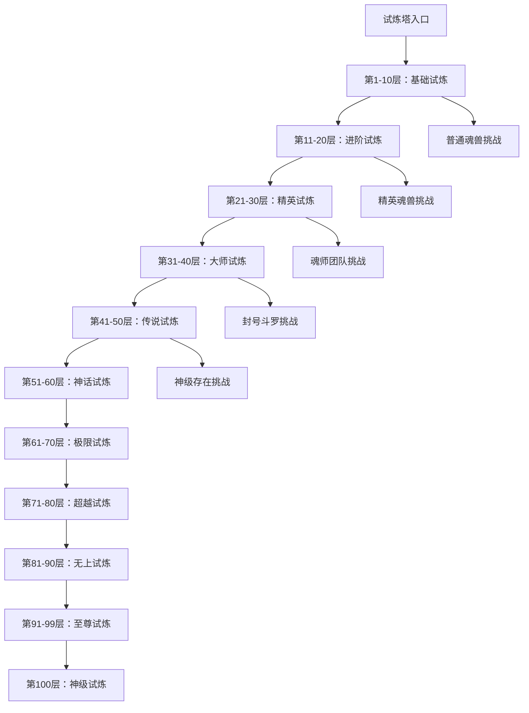

# 斗罗大陆回合制游戏玩法规划设计
# 斗罗大陆回合制游戏玩法规划设计

## 概述

本设计文档旨在规划一款基于斗罗大陆世界观的回合制RPG游戏，包含角色收集培养、魂环魂骨系统、技能战斗等核心玩法。游戏将忠实还原原著中的角色设定、武魂体系和修炼机制，为玩家提供沉浸式的斗罗大陆体验。

### 设计目标
- 忠实还原斗罗大陆世界观和角色设定
- 构建深度的角色养成体系
- 设计策略性的回合制战斗系统
- 实现多样化的魂环魂骨收集玩法

## 游戏架构

### 核心系统架构



## 角色系统完整设计

### 游戏角色完整名单

#### 史莱克七怪（主角团）
| 角色名称 | 武魂名称 | 角色定位 | 初始品质 | 获取方式 | 特殊标识 |
|---------|---------|---------|---------|---------|----------|
| 唐三 | 蓝银草/昊天锤 | 全能控制 | 白色→神级 | 主线赠送 | 双武魂主角 |
| 小舞 | 柔骨兔 | 敏攻刺客 | 绿色→红色 | 主线赠送 | 魂兽化身 |
| 戴沐白 | 白虎 | 强攻坦克 | 蓝色→橙色 | 主线赠送 | 皇室血统 |
| 奥斯卡 | 香肠 | 食物辅助 | 白色→紫色 | 主线赠送 | 食物系武魂 |
| 马红俊 | 邪火凤凰 | 火系输出 | 绿色→橙色 | 主线赠送 | 变异武魂 |
| 宁荣荣 | 七宝琉璃塔 | 增益辅助 | 蓝色→红色 | 主线赠送 | 七宝琉璃宗 |
| 朱竹清 | 幽冥灵猫 | 敏攻刺客 | 蓝色→橙色 | 主线赠送 | 暗影系 |

#### 史莱克学院相关
| 角色名称 | 武魂名称 | 角色定位 | 初始品质 | 获取方式 | 特殊标识 |
|---------|---------|---------|---------|---------|----------|
| 弗兰德 | 四眼猫鹰 | 敏攻控制 | 紫色 | 剧情获得 | 学院院长 |
| 赵无极 | 大力金刚熊 | 防御坦克 | 紫色 | 剧情获得 | 不动明王 |
| 玉小刚 | 罗三炮 | 理论支援 | 白色 | 剧情获得 | 理论大师 |
| 柳二龙 | 火龙 | 火系强攻 | 紫色 | 剧情获得 | 黄金铁三角 |
| 李郁松 | 龙纹棍 | 武器强攻 | 绿色 | 剧情获得 | 棍法大师 |
| 卢奇斌 | 星罗棋 | 控制辅助 | 绿色 | 剧情获得 | 棋道高手 |
| 邵鑫 | 糖豆 | 食物辅助 | 绿色 | 剧情获得 | 糖果大师 |

#### 皇斗战队
| 角色名称 | 武魂名称 | 角色定位 | 初始品质 | 获取方式 | 特殊标识 |
|---------|---------|---------|---------|---------|----------|
| 玉天恒 | 蓝电霸王龙 | 雷系强攻 | 紫色→橙色 | 抽卡获得 | 蓝电霸王龙宗 |
| 独孤雁 | 碧鳞蛇 | 毒系控制 | 紫色 | 抽卡获得 | 毒斗罗之孙女 |
| 叶泠泠 | 九心海棠 | 治疗辅助 | 橙色 | 限定抽卡 | 治疗专精 |
| 石家兄弟 | 玄武龟 | 防御坦克 | 蓝色 | 抽卡获得 | 龟甲防御 |
| 奥斯罗 | 鬼豹 | 敏攻刺客 | 蓝色 | 抽卡获得 | 速度型 |
| 御风 | 风铃鸟 | 辅助控制 | 蓝色 | 抽卡获得 | 风系武魂 |

#### 武魂殿阵营
| 角色名称 | 武魂名称 | 角色定位 | 初始品质 | 获取方式 | 特殊标识 |
|---------|---------|---------|---------|---------|----------|
| 比比东 | 死亡蛛皇 | 控制输出 | 红色→神级 | 限定抽卡 | 武魂殿教皇 |
| 千仞雪 | 六翼天使 | 光系强攻 | 红色→神级 | 限定抽卡 | 天使神传承 |
| 胡列娜 | 妖狐 | 魅惑控制 | 橙色 | 抽卡获得 | 黄金一代 |
| 邪月 | 月刃 | 双刀强攻 | 橙色 | 抽卡获得 | 黄金一代 |
| 焱 | 火焰领主 | 火系强攻 | 橙色 | 抽卡获得 | 黄金一代 |
| 鬼斗罗 | 鬼魅 | 暗影刺客 | 红色 | 限定抽卡 | 封号斗罗 |
| 菊斗罗 | 奇茸通天菊 | 控制辅助 | 红色 | 限定抽卡 | 封号斗罗 |

#### 其他重要角色
| 角色名称 | 武魂名称 | 角色定位 | 初始品质 | 获取方式 | 特殊标识 |
|---------|---------|---------|---------|---------|----------|
| 独孤博 | 碧鳞蛇皇 | 毒系控制 | 红色 | 限定抽卡 | 毒斗罗 |
| 唐昊 | 昊天锤 | 极致强攻 | 红色→神级 | 限定抽卡 | 昊天斗罗 |
| 阿银 | 蓝银皇 | 治疗控制 | 红色 | 特殊获得 | 植物系皇者 |
| 大明 | 天青牛蟒本体 | 力量坦克 | 紫色→红色 | 特殊获得 | 森林之王 |
| 二明 | 泰坦巨猿本体 | 力量输出 | 紫色→红色 | 特殊获得 | 森林之王 |

### 角色详细数值规划

#### 唐三（主角）详细设计

**基础信息**
- 武魂：蓝银草→蓝银皇（双武魂：昊天锤）
- 初始品质：白色（可成长至神级）
- 角色定位：全能控制型
- 特殊机制：双武魂觉醒、主角光环、无限成长

**基础属性（1级白色品质）**
| 属性名称 | 基础数值 | 成长系数 | 品质加成 | 满级数值（100级神级） |
|---------|---------|---------|---------|---------------------|
| 生命值 | 120 | +15/级 | ×10.0 | 15000 |
| 攻击力 | 25 | +3/级 | ×10.0 | 3000 |
| 魂力 | 30 | +4/级 | ×10.0 | 4000 |
| 防御力 | 20 | +2/级 | ×10.0 | 2000 |
| 魂防 | 25 | +3/级 | ×10.0 | 3000 |
| 速度 | 22 | +2/级 | ×10.0 | 2200 |
| 暴击率 | 5% | +0.2%/级 | +20% | 45% |
| 暴击伤害 | 150% | +1%/级 | +100% | 350% |

**魂环技能详细设计**

**蓝银草形态技能**
| 魂环位置 | 技能名称 | 技能类型 | 威力系数 | 特殊效果 | 冷却时间 | 魂力消耗 |
|---------|---------|---------|---------|---------|---------|----------|
| 第一魂环 | 缠绕 | 控制 | 0.8×魂力 | 束缚敌人1回合，无法行动 | 1回合 | 20 |
| 第二魂环 | 寄生 | 持续伤害 | 1.2×魂力 | 持续3回合，每回合造成伤害 | 2回合 | 35 |
| 第三魂环 | 蛛网束缚 | 群体控制 | 1.5×魂力 | 群体束缚，减速50% | 3回合 | 50 |
| 第四魂环 | 蓝银突刺阵 | 群体攻击 | 2.2×魂力 | 范围攻击，附带流血效果 | 4回合 | 80 |
| 第五魂环 | 蓝银皇·金刚不坏 | 增益 | - | 免疫控制，防御+100% | 5回合 | 120 |
| 第六魂环 | 蓝银皇·飞叶神光 | 单体必杀 | 4.5×魂力 | 必定暴击，穿透防御50% | 6回合 | 180 |
| 第七魂环 | 蓝银真身 | 变身 | - | 全属性+150%，持续5回合 | 10回合 | 300 |

**昊天锤形态技能**
| 魂环位置 | 技能名称 | 技能类型 | 威力系数 | 特殊效果 | 冷却时间 | 魂力消耗 |
|---------|---------|---------|---------|---------|---------|----------|
| 第一魂环 | 雷霆一击 | 单体攻击 | 2.5×攻击力 | 附带眩晕效果 | 1回合 | 25 |
| 第二魂环 | 破甲重击 | 单体攻击 | 3.2×攻击力 | 无视防御30% | 2回合 | 40 |
| 第三魂环 | 昊天锤法·乱披风 | 连击 | 4×2.0×攻击力 | 连续4次攻击 | 3回合 | 60 |
| 第四魂环 | 昊天·大须弥锤 | 群体攻击 | 4.5×攻击力 | 范围震撼，降低敌方攻击 | 4回合 | 100 |
| 第五魂环 | 昊天·炸环 | 爆发攻击 | 6.0×攻击力 | 牺牲一个魂环，巨额伤害 | 一次性 | 150 |
| 第六魂环 | 昊天锤真身预备 | 增益 | - | 下回合武魂真身威力+100% | 5回合 | 200 |
| 第七魂环 | 昊天真身 | 变身 | - | 全属性翻倍，获得飞行能力 | 8回合 | 350 |

#### 小舞（魂兽化身）详细设计

**基础信息**
- 武魂：柔骨兔（十万年魂兽本体）
- 初始品质：绿色（可觉醒至红色）
- 角色定位：敏攻刺客
- 特殊机制：魂兽本体、瞬移能力、献祭觉醒

**基础属性（5级绿色品质）**
| 属性名称 | 基础数值 | 成长系数 | 品质加成 | 满级数值（90级红色） |
|---------|---------|---------|---------|-------------------|
| 生命值 | 150 | +12/级 | ×5.0 | 6000 |
| 攻击力 | 35 | +4/级 | ×5.0 | 1750 |
| 魂力 | 25 | +3/级 | ×5.0 | 1250 |
| 防御力 | 18 | +2/级 | ×5.0 | 900 |
| 魂防 | 20 | +2/级 | ×5.0 | 1000 |
| 速度 | 45 | +3/级 | ×5.0 | 2250 |
| 暴击率 | 15% | +0.3%/级 | +25% | 65% |
| 闪避率 | 20% | +0.25%/级 | +20% | 62.5% |

**魂环技能设计**
| 魂环位置 | 技能名称 | 技能类型 | 威力系数 | 特殊效果 | 冷却时间 | 魂力消耗 |
|---------|---------|---------|---------|---------|---------|----------|
| 第一魂环 | 腰弓 | 单体攻击 | 2.8×攻击力 | 必中攻击，造成腰部重创 | 1回合 | 22 |
| 第二魂环 | 魅惑 | 控制 | - | 控制敌人1回合为己方战斗 | 2回合 | 35 |
| 第三魂环 | 瞬移 | 位移攻击 | 3.5×攻击力 | 瞬移到敌人身后攻击 | 2回合 | 45 |
| 第四魂环 | 无敌金身 | 防御 | - | 1回合内免疫所有伤害 | 5回合 | 80 |
| 第五魂环 | 柔技·分筋错骨手 | 减益攻击 | 4.2×攻击力 | 降低敌人50%攻击防御 | 4回合 | 100 |
| 第六魂环 | 十万年献祭 | 复活技能 | - | 死亡时复活队友并全员回满血 | 被动触发 | - |

#### 戴沐白（白虎武魂）详细设计

**基础信息**
- 武魂：白虎（星罗皇室血统）
- 初始品质：蓝色（可觉醒至橙色）
- 角色定位：强攻坦克
- 特殊机制：皇室血统、白虎变身、怒气系统

**基础属性（15级蓝色品质）**
| 属性名称 | 基础数值 | 成长系数 | 品质加成 | 满级数值（80级橙色） |
|---------|---------|---------|---------|--------------------|
| 生命值 | 280 | +18/级 | ×3.0 | 8400 |
| 攻击力 | 45 | +5/级 | ×3.0 | 1350 |
| 魂力 | 20 | +2/级 | ×3.0 | 600 |
| 防御力 | 35 | +4/级 | ×3.0 | 1050 |
| 魂防 | 25 | +3/级 | ×3.0 | 750 |
| 速度 | 30 | +2/级 | ×3.0 | 600 |
| 暴击率 | 20% | +0.4%/级 | +15% | 67% |
| 暴击伤害 | 180% | +1.5%/级 | +50% | 350% |

**魂环技能设计**
| 魂环位置 | 技能名称 | 技能类型 | 威力系数 | 特殊效果 | 冷却时间 | 魂力消耗 |
|---------|---------|---------|---------|---------|---------|----------|
| 第一魂环 | 白虎护身障 | 防御增益 | - | 防御力+50%，持续3回合 | 2回合 | 25 |
| 第二魂环 | 白虎烈光波 | 远程攻击 | 3.2×攻击力 | 光属性伤害，可穿透 | 1回合 | 30 |
| 第三魂环 | 白虎金刚变 | 变身强化 | - | 攻击+80%，抗控+100% | 3回合 | 50 |
| 第四魂环 | 白虎流星雨 | 群体攻击 | 4.0×攻击力 | 范围攻击，降低敌方命中 | 4回合 | 80 |
| 第五魂环 | 白虎魔神变 | 狂暴变身 | - | 全属性+100%，生命-50% | 5回合 | 120 |
| 第六魂环 | 白虎灭世 | 终极技能 | 6.5×攻击力 | 无视防御，必定暴击 | 8回合 | 200 |
| 第七魂环 | 白虎真身 | 武魂真身 | - | 体型巨大化，全能力翻倍 | 10回合 | 300 |

#### 奥斯卡（香肠武魂）详细设计

**基础信息**
- 武魂：香肠（食物系武魂）
- 初始品质：白色（可成长至紫色）
- 角色定位：食物辅助
- 特殊机制：食物制作、魂咒系统、辅助专精

**基础属性（8级白色品质）**
| 属性名称 | 基础数值 | 成长系数 | 品质加成 | 满级数值（70级紫色） |
|---------|---------|---------|---------|--------------------|
| 生命值 | 110 | +8/级 | ×2.0 | 1120 |
| 攻击力 | 15 | +1/级 | ×2.0 | 140 |
| 魂力 | 50 | +6/级 | ×2.0 | 840 |
| 防御力 | 20 | +2/级 | ×2.0 | 280 |
| 魂防 | 40 | +4/级 | ×2.0 | 560 |
| 速度 | 25 | +2/级 | ×2.0 | 340 |
| 治疗效果 | 150% | +2%/级 | +100% | 390% |
| 魂力恢复 | 200% | +3%/级 | +150% | 560% |

**魂环技能设计**
| 魂环位置 | 技能名称 | 技能类型 | 威力系数 | 特殊效果 | 冷却时间 | 魂力消耗 |
|---------|---------|---------|---------|---------|---------|----------|
| 第一魂环 | 恢复大香肠 | 治疗 | 2.5×魂力 | 单体大量治疗 | 1回合 | 20 |
| 第二魂环 | 解毒小腊肠 | 净化 | - | 解除所有负面状态 | 1回合 | 25 |
| 第三魂环 | 飞行蘑菇肠 | 增益 | - | 获得飞行能力3回合 | 3回合 | 40 |
| 第四魂环 | 激昂粉红肠 | 群体增益 | - | 全队攻击+50%，持续5回合 | 5回合 | 80 |
| 第五魂环 | 亢奋金苍蝇 | 超级增益 | - | 单体全属性+100%，持续3回合 | 8回合 | 150 |
| 第六魂环 | 镜像肠 | 复制技能 | - | 复制队友上一个技能 | 6回合 | 120 |
| 第七魂环 | 香肠真身 | 武魂真身 | - | 制造效果翻倍，无消耗 | 10回合 | 200 |

#### 马红俊（邪火凤凰）详细设计

**基础信息**
- 武魂：邪火凤凰（变异火凤凰）
- 初始品质：绿色（可觉醒至橙色）
- 角色定位：火系输出
- 特殊机制：邪火爆发、凤凰涅槃、变异进化

**基础属性（10级绿色品质）**
| 属性名称 | 基础数值 | 成长系数 | 品质加成 | 满级数值（80级橙色） |
|---------|---------|---------|---------|--------------------|
| 生命值 | 160 | +10/级 | ×3.0 | 4800 |
| 攻击力 | 40 | +4/级 | ×3.0 | 1200 |
| 魂力 | 45 | +5/级 | ×3.0 | 1350 |
| 防御力 | 22 | +2/级 | ×3.0 | 660 |
| 魂防 | 30 | +3/级 | ×3.0 | 900 |
| 速度 | 35 | +3/级 | ×3.0 | 1050 |
| 火属性伤害 | +50% | +1%/级 | +100% | +220% |
| 火属性抗性 | 80% | +0.5%/级 | +20% | 135% |

**魂环技能设计**
| 魂环位置 | 技能名称 | 技能类型 | 威力系数 | 特殊效果 | 冷却时间 | 魂力消耗 |
|---------|---------|---------|---------|---------|---------|----------|
| 第一魂环 | 凤凰火线 | 直线攻击 | 2.8×魂力 | 直线范围火焰攻击 | 1回合 | 22 |
| 第二魂环 | 浴火重生 | 自我治疗 | 3.0×魂力 | 治疗自身，移除负面状态 | 3回合 | 35 |
| 第三魂环 | 凤凰啸天击 | 单体爆发 | 4.5×魂力 | 高额单体伤害，附带灼烧 | 2回合 | 50 |
| 第四魂环 | 凤凰流星雨 | 群体攻击 | 3.8×魂力 | 多次随机攻击敌方全体 | 4回合 | 90 |
| 第五魂环 | 邪火燎原 | 领域技能 | 2.5×魂力 | 战场燃烧，持续伤害3回合 | 6回合 | 130 |
| 第六魂环 | 凤凰涅槃 | 复活技能 | - | 死亡时满血复活，全属性+50% | 被动触发 | 所有魂力 |
| 第七魂环 | 邪火凤凰真身 | 武魂真身 | - | 化身火凤凰，飞行+火免疫 | 8回合 | 250 |

#### 宁荣荣（七宝琉璃塔）详细设计

**基础信息**
- 武魂：七宝琉璃塔（辅助系器武魂）
- 初始品质：蓝色（可觉醒至红色）
- 角色定位：增益辅助
- 特殊机制：七宝增幅、九宝进化、宗门传承

**基础属性（18级蓝色品质）**
| 属性名称 | 基础数值 | 成长系数 | 品质加成 | 满级数值（90级红色） |
|---------|---------|---------|---------|--------------------|
| 生命值 | 130 | +8/级 | ×5.0 | 5200 |
| 攻击力 | 8 | +0.5/级 | ×5.0 | 200 |
| 魂力 | 65 | +8/级 | ×5.0 | 2600 |
| 防御力 | 15 | +1/级 | ×5.0 | 600 |
| 魂防 | 50 | +5/级 | ×5.0 | 2000 |
| 速度 | 40 | +4/级 | ×5.0 | 1600 |
| 辅助效果 | +100% | +3%/级 | +200% | +570% |
| 增益持续 | +50% | +1%/级 | +100% | +240% |

**魂环技能设计**
| 魂环位置 | 技能名称 | 技能类型 | 威力系数 | 特殊效果 | 冷却时间 | 魂力消耗 |
|---------|---------|---------|---------|---------|---------|----------|
| 第一魂环 | 七宝有名，一曰：力 | 攻击增益 | - | 单体攻击力+30%，持续5回合 | 1回合 | 15 |
| 第二魂环 | 七宝有名，二曰：速 | 速度增益 | - | 单体速度+50%，持续5回合 | 1回合 | 20 |
| 第三魂环 | 七宝有名，三曰：魂 | 魂力增益 | - | 单体魂力+40%，持续5回合 | 2回合 | 30 |
| 第四魂环 | 七宝有名，四曰：御 | 防御增益 | - | 单体防御+60%，持续5回合 | 2回合 | 40 |
| 第五魂环 | 七宝有名，五曰：治 | 治疗技能 | 4.0×魂力 | 持续治疗，每回合恢复生命 | 3回合 | 80 |
| 第六魂环 | 七宝有名，六曰：增 | 全属性增益 | - | 单体全属性+50%，持续8回合 | 5回合 | 120 |
| 第七魂环 | 七宝琉璃塔真身 | 武魂真身 | - | 增益效果翻倍，群体作用 | 8回合 | 200 |

#### 比比东（教皇）详细设计

**基础信息**
- 武魂：死亡蛛皇（双武魂：噬魂蛛皇）
- 初始品质：红色（可成长至神级）
- 角色定位：控制输出
- 特殊机制：罗刹神传承、双武魂融合、教皇权威

**基础属性（95级红色品质）**
| 属性名称 | 基础数值 | 成长系数 | 品质加成 | 满级数值（100级神级） |
|---------|---------|---------|---------|---------------------|
| 生命值 | 800 | +25/级 | ×5.0 | 12500 |
| 攻击力 | 120 | +8/级 | ×5.0 | 4000 |
| 魂力 | 150 | +10/级 | ×5.0 | 5000 |
| 防御力 | 80 | +5/级 | ×5.0 | 2500 |
| 魂防 | 100 | +7/级 | ×5.0 | 3500 |
| 速度 | 90 | +6/级 | ×5.0 | 3000 |
| 暴击率 | 40% | +0.8%/级 | +30% | 110% |
| 毒抗性 | 100% | - | +50% | 150% |

**魂环技能设计**
| 魂环位置 | 技能名称 | 技能类型 | 威力系数 | 特殊效果 | 冷却时间 | 魂力消耗 |
|---------|---------|---------|---------|---------|---------|----------|
| 第一魂环 | 蛛网束缚 | 群体控制 | 2.0×魂力 | 全体敌人束缚2回合 | 2回合 | 40 |
| 第二魂环 | 死亡毒刺 | 单体攻击 | 4.5×魂力 | 剧毒伤害，持续5回合 | 1回合 | 50 |
| 第三魂环 | 蛛皇领域 | 领域技能 | - | 减少敌方50%属性，持续全战 | 8回合 | 120 |
| 第四魂环 | 死神镰刀 | 群体攻击 | 5.5×魂力 | 范围攻击，吸取生命值 | 3回合 | 100 |
| 第五魂环 | 噬魂蛛皇附体 | 变身技能 | - | 免疫控制，攻击+100% | 6回合 | 150 |
| 第六魂环 | 死亡凝视 | 即死技能 | - | 50%概率秒杀，否则重伤 | 8回合 | 200 |
| 第七魂环 | 死亡蛛皇真身 | 武魂真身 | - | 体型巨大化，毒免疫范围 | 10回合 | 300 |
| 第八魂环 | 罗刹魔镰 | 神级技能 | 8.0×魂力 | 无视防御，必定暴击 | 12回合 | 400 |
| 第九魂环 | 罗刹神降临 | 终极技能 | 15.0×魂力 | 罗刹神之力，毁天灭地 | 单场1次 | 500 |

#### 千仞雪（天使神传承）详细设计

**基础信息**
- 武魂：六翼天使（神级天使武魂）
- 初始品质：红色（可成长至神级）
- 角色定位：光系强攻
- 特殊机制：天使神传承、光属性免疫、神圣审判

**基础属性（95级红色品质）**
| 属性名称 | 基础数值 | 成长系数 | 品质加成 | 满级数值（100级神级） |
|---------|---------|---------|---------|---------------------|
| 生命值 | 750 | +22/级 | ×5.0 | 11000 |
| 攻击力 | 130 | +9/级 | ×5.0 | 4500 |
| 魂力 | 140 | +9/级 | ×5.0 | 4500 |
| 防御力 | 90 | +6/级 | ×5.0 | 3000 |
| 魂防 | 110 | +8/级 | ×5.0 | 4000 |
| 速度 | 100 | +7/级 | ×5.0 | 3500 |
| 光属性伤害 | +100% | +2%/级 | +100% | +300% |
| 光属性抗性 | 100% | - | +50% | 150% |

**魂环技能设计**
| 魂环位置 | 技能名称 | 技能类型 | 威力系数 | 特殊效果 | 冷却时间 | 魂力消耗 |
|---------|---------|---------|---------|---------|---------|----------|
| 第一魂环 | 天使突袭 | 单体攻击 | 3.5×攻击力 | 光属性伤害，净化负面状态 | 1回合 | 30 |
| 第二魂环 | 神圣之光 | 群体治疗 | 3.0×魂力 | 全体治疗+驱散负面效果 | 2回合 | 40 |
| 第三魂环 | 天使守护 | 防御技能 | - | 全队免疫负面状态3回合 | 4回合 | 60 |
| 第四魂环 | 天使裁决 | 单体爆发 | 6.0×攻击力 | 对邪恶属性双倍伤害 | 3回合 | 90 |
| 第五魂环 | 六翼天使降临 | 变身技能 | - | 获得飞行，全属性+80% | 5回合 | 120 |
| 第六魂环 | 神圣审判 | 群体攻击 | 5.5×魂力 | 范围光属性攻击，净化邪恶 | 6回合 | 180 |
| 第七魂环 | 天使真身 | 武魂真身 | - | 天使形态，光属性免疫 | 8回合 | 250 |
| 第八魂环 | 天使神剑 | 神级技能 | 8.5×攻击力 | 神圣之剑，切断一切黑暗 | 10回合 | 350 |
| 第九魂环 | 天使神降世 | 终极技能 | 20.0×魂力 | 天使神之力，审判世间 | 单场1次 | 全部魂力 |

#### 独孤博（毒斗罗）详细设计

**基础信息**
- 武魂：碧鳞蛇皇（毒属性顶级武魂）
- 初始品质：红色
- 角色定位：毒系控制
- 特殊机制：毒免疫、毒素累积、生死门配置

**基础属性（92级红色品质）**
| 属性名称 | 基础数值 | 成长系数 | 品质加成 | 满级数值（92级红色） |
|---------|---------|---------|---------|--------------------|
| 生命值 | 650 | +20/级 | ×2.8 | 5096 |
| 攻击力 | 85 | +6/级 | ×2.8 | 1478 |
| 魂力 | 160 | +12/级 | ×2.8 | 3019 |
| 防御力 | 70 | +5/级 | ×2.8 | 1274 |
| 魂防 | 120 | +8/级 | ×2.8 | 2022 |
| 速度 | 75 | +5/级 | ×2.8 | 1288 |
| 毒属性伤害 | +150% | +3%/级 | +100% | +526% |
| 毒抗性 | 100% | - | +50% | 150% |

**魂环技能设计**
| 魂环位置 | 技能名称 | 技能类型 | 威力系数 | 特殊效果 | 冷却时间 | 魂力消耗 |
|---------|---------|---------|---------|---------|---------|----------|
| 第一魂环 | 碧鳞毒雾 | 群体毒素 | 1.5×魂力 | 全体中毒，持续5回合 | 2回合 | 35 |
| 第二魂环 | 蛇皇凝视 | 控制技能 | - | 单体麻痹2回合，不可行动 | 3回合 | 40 |
| 第三魂环 | 毒素爆发 | 毒伤引爆 | 累积毒伤×3 | 引爆毒素，造成累积伤害 | 1回合 | 50 |
| 第四魂环 | 碧鳞蛇阵 | 领域技能 | - | 毒素领域，每回合自动中毒 | 全战生效 | 100 |
| 第五魂环 | 毒龙钻 | 单体必杀 | 7.0×魂力 | 穿透攻击，剧毒侵蚀 | 4回合 | 120 |
| 第六魂环 | 碧鳞蛇皇变 | 变身技能 | - | 化身蛇皇，毒免+反弹毒素 | 6回合 | 150 |
| 第七魂环 | 碧鳞蛇皇真身 | 武魂真身 | - | 巨蛇形态，毒素范围扩大 | 8回合 | 200 |
| 第八魂环 | 生死门毒阵 | 终极控制 | - | 生死门，选择生或死 | 10回合 | 300 |
| 第九魂环 | 毒皇降世 | 终极技能 | 12.0×魂力 | 万毒之王，毒杀一切 | 单场1次 | 400 |

#### 唐昊（昊天斗罗）详细设计

**基础信息**
- 武魂：昊天锤（天下第一器武魂）
- 初始品质：红色（可成长至神级）
- 角色定位：极致强攻
- 特殊机制：昊天九绝、炸环技能、乱披风锤法

**基础属性（95级红色品质）**
| 属性名称 | 基础数值 | 成长系数 | 品质加成 | 满级数值（100级神级） |
|---------|---------|---------|---------|---------------------|
| 生命值 | 900 | +28/级 | ×5.0 | 14000 |
| 攻击力 | 180 | +12/级 | ×5.0 | 6000 |
| 魂力 | 100 | +6/级 | ×5.0 | 3000 |
| 防御力 | 120 | +8/级 | ×5.0 | 4000 |
| 魂防 | 80 | +5/级 | ×5.0 | 2500 |
| 速度 | 60 | +4/级 | ×5.0 | 2000 |
| 暴击率 | 50% | +1%/级 | +30% | 130% |
| 暴击伤害 | 300% | +3%/级 | +200% | 800% |

**魂环技能设计**
| 魂环位置 | 技能名称 | 技能类型 | 威力系数 | 特殊效果 | 冷却时间 | 魂力消耗 |
|---------|---------|---------|---------|---------|---------|----------|
| 第一魂环 | 昊天锤第一式 | 单体攻击 | 4.0×攻击力 | 基础锤法，无视护甲 | 1回合 | 30 |
| 第二魂环 | 昊天锤第二式 | 蓄力攻击 | 6.0×攻击力 | 蓄力1回合，威力翻倍 | 3回合 | 50 |
| 第三魂环 | 乱披风锤法 | 连击技能 | 9×2.5×攻击力 | 连续9次攻击，递增威力 | 4回合 | 80 |
| 第四魂环 | 昊天锤第四式 | 群体攻击 | 5.0×攻击力 | 范围震击，降低敌方防御 | 3回合 | 100 |
| 第五魂环 | 炸环·第五魂环 | 爆发技能 | 10.0×攻击力 | 牺牲魂环，巨额伤害 | 一次性 | - |
| 第六魂环 | 昊天锤奥义 | 必杀技能 | 8.0×攻击力 | 必定暴击，穿透一切防御 | 6回合 | 150 |
| 第七魂环 | 昊天锤真身 | 武魂真身 | - | 锤神降世，攻击力翻倍 | 8回合 | 200 |
| 第八魂环 | 昊天九绝·第一绝 | 神级技能 | 12.0×攻击力 | 封号斗罗级别锤法 | 10回合 | 300 |
| 第九魂环 | 昊天锤·开天辟地 | 终极技能 | 25.0×攻击力 | 神锤之威，开天辟地 | 单场1次 | 500 |

### 角色培养成长曲线设计

#### 属性成长曲线规划



#### 不同品质角色成长对比

| 等级段 | 白色角色 | 绿色角色 | 蓝色角色 | 紫色角色 | 橙色角色 | 红色角色 | 神级角色 |
|-------|---------|---------|---------|---------|---------|---------|----------|
| 1-20级 | 基础增长 | 110%基础 | 130%基础 | 160%基础 | 210%基础 | 280%基础 | 400%基础 |
| 21-40级 | 上限受限 | 120%基础 | 150%基础 | 200%基础 | 300%基础 | 500%基础 | 800%基础 |
| 41-60级 | 无法达到 | 上限受限 | 150%基础 | 250%基础 | 400%基础 | 800%基础 | 1500%基础 |
| 61-80级 | 无法达到 | 无法达到 | 上限受限 | 300%基础 | 600%基础 | 1200%基础 | 3000%基础 |
| 81-100级 | 无法达到 | 无法达到 | 无法达到 | 上限受限 | 800%基础 | 2000%基础 | 8000%基础 |
| 100级+ | 无法达到 | 无法达到 | 无法达到 | 无法达到 | 上限受限 | 3000%基础 | 无限成长 |

### 特殊角色机制详细设计

#### 主角唐三双武魂机制



#### 魂兽角色特殊机制

| 魂兽角色 | 特殊机制 | 觉醒条件 | 觉醒效果 | 限制因素 |
|---------|---------|---------|---------|----------|
| 小舞 | 十万年献祭 | 生命值归零时 | 复活队友+全体回血 | 单场限一次 |
| 大明 | 森林之王 | 森林地形战斗 | 全属性+50% | 地形限制 |
| 二明 | 力量爆发 | 生命值低于30% | 攻击力翻倍 | 低血量触发 |
| 天青牛蟒 | 万年修为 | 等级达到50级 | 解锁真身形态 | 等级限制 |
| 泰坦巨猿 | 巨力无穷 | 连续3次暴击 | 下次攻击无视防御 | 连击条件 |

#### 宗门角色加成机制

| 宗门势力 | 代表角色 | 宗门加成 | 组队效果 | 特殊技能 |
|---------|---------|---------|---------|----------|
| 七宝琉璃宗 | 宁荣荣、宁风致 | 辅助效果+50% | 全队属性+20% | 七位一体 |
| 蓝电霸王龙宗 | 玉天恒、玉元震 | 雷属性+100% | 雷系技能威力+30% | 龙族血脉 |
| 昊天宗 | 唐昊、唐三 | 攻击力+80% | 器武魂威力+25% | 昊天九绝 |
| 武魂殿 | 比比东、千仞雪 | 全属性+30% | 武魂觉醒概率+50% | 神级传承 |
| 史莱克学院 | 七怪全员 | 成长速度+100% | 团队配合+完美 | 七位一体融合技 |----------------|
| 生命值 | 140 | +9/级 | ×3.0 | 4200 |
| 攻击力 | 50 | +5/级 | ×3.0 | 1500 |
| 魂力 | 30 | +3/级 | ×3.0 | 900 |
| 防御力 | 25 | +2/级 | ×3.0 | 750 |
| 魂防 | 30 | +3/级 | ×3.0 | 900 |
| 速度 | 55 | +4/级 | ×3.0 | 1650 |
| 暴击率 | 25% | +0.5%/级 | +25% | 80% |
| 闪避率 | 30% | +0.4%/级 | +20% | 82% |

**魂环技能设计**
| 魂环位置 | 技能名称 | 技能类型 | 威力系数 | 特殊效果 | 冷却时间 | 魂力消耗 |
|---------|---------|---------|---------|---------|---------|----------|
| 第一魂环 | 幽冥突刺 | 单体攻击 | 3.2×攻击力 | 必定暴击，附带流血 | 1回合 | 25 |
| 第二魂环 | 幽冥百爪 | 连击攻击 | 5×1.8×攻击力 | 连续5次攻击 | 2回合 | 40 |
| 第三魂环 | 幽冥分身 | 分身技能 | - | 制造分身，承受1次伤害 | 3回合 | 50 |
| 第四魂环 | 幽冥潜行 | 隐身技能 | - | 隐身2回合，下次攻击必暴击 | 5回合 | 80 |
| 第五魂环 | 幽冥地狱路 | 群体攻击 | 4.5×攻击力 | 范围暗属性攻击，降低命中 | 4回合 | 120 |
| 第六魂环 | 幽冥死神镰 | 终极技能 | 7.0×攻击力 | 忽视防御，必定致命一击 | 7回合 | 180 |
| 第七魂环 | 幽冥灵猫真身 | 武魂真身 | - | 暗影形态，物免+50%闪避 | 8回合 | 250 |

## 角色系统设计

### 角色获取机制设计

#### 角色获取途径详细规划

``mermaid
flowchart TD
    A[角色获取] --> B[主线剧情赠送]
    A --> C[抽卡系统]
    A --> D[活动奖励]
    A --> E[商店兑换]
    A --> F[任务奖励]
    A --> G[成就解锁]
    A --> H[特殊途径]
    
    B --> B1[固定低品质角色]
    B --> B2[剧情关键角色]
    B --> B3[隐藏角色觉醒]
    B --> B4[主角成长系列]
    
    C --> C1[新手友情池]
    C --> C2[标准角色池] 
    C --> C3[精选UP池]
    C --> C4[限定角色池]
    C --> C5[武魂觉醒池]
    C --> C6[魂兽伙伴池]
    C --> C7[神级传承池]
    
    D --> D1[日常登录奖励]
    D --> D2[特殊活动任务]
    D --> D3[节日庆典奖励]
    D --> D4[限时挑战奖励]
    D --> D5[首充特惠奖励]
    
    E --> E1[荣誉积分商店]
    E --> E2[竞技圻场商店]
    E --> E3[宗门贡献商店]
    E --> E4[友情点商店]
    E --> E5[特殊货币商店]
    
    F --> F1[主线任务链]
    F --> F2[支线剧情任务]
    F --> F3[每日委托任务]
    F --> F4[周常挑战任务]
    F --> F5[成就系统任务]
    
    G --> G1[收集类成就]
    G --> G2[战斗类成就]
    G --> G3[探索类成就]
    G --> G4[社交类成就]
    G --> G5[特殊隐藏成就]
    
    H --> H1[魂环狩猎概率获得]
    H --> H2[魂骨融合触发]
    H --> H3[特殊场景事件]
    H --> H4[隐藏副本奖励]
```

#### 主线赠送角色详细规划

| 剧情章节 | 赠送角色 | 初始品质 | 初始等级 | 武魂属性 | 特殊机制 | 后期潜力 | 获得条件 |
|---------|---------|---------|---------|---------|---------|---------|---------|
| 第1章-诺丁学院 | 唐三 | 白色(可成长) | 1级 | 蓝银草(隐藏昊天锤) | 主角光环+双武魂 | 可成长至神级 | 开启游戏自动获得 |
| 第2章-工读生涯 | 小舞 | 绿色(隐藏) | 5级 | 柔骨兔(隐藏十万年) | 魂兽化身+后期觉醒 | 红色品质觉醒 | 完成第1章主线 |
| 第3章-史莱克入学 | 奥斯卡 | 白色 | 8级 | 香肠(食物系) | 轅助专精+咒语 | 紫色上限 | 史莱克学院考试通过 |
| 第4章-团队组建 | 马红俊 | 绿色 | 10级 | 邪火凤凰 | 火属性输出+变异 | 橙色上限 | 组队任务触发 |
| 第5章-索托城历练 | 戴沐白 | 蓝色 | 15级 | 白虎 | 坦克输出双修+皇族 | 橙色上限 | 大斗魂场初试 |
| 第6章-七宝琉璃 | 宁荣荣 | 蓝色 | 18级 | 七宝琉璃塔 | 顶级辅助+九宝进化 | 红色上限 | 七宝琉璃宗认可 |
| 第7章-幽冥灵猫 | 朱竹清 | 蓝色 | 20级 | 幽冥灵猫 | 高敏刺客+暗属性 | 橙色上限 | 星罗森林历练 |
| 第8章-大师指点 | 玉小刚(大师) | 白色 | 25级 | 罗三炮(废武魂) | 理论大师+特殊导师 | 无战斗价值 | 理论考试满分 |
| 第9章-泰坦巨猿 | 二明 | 紫色(隐藏) | 30级 | 泰坦巨猿本体 | 魂兽盟友+后期加入 | 红色品质 | 森林中心事件 |
| 第10章-天青牛蟒 | 大明 | 紫色(隐藏) | 35级 | 天青牛蟒本体 | 魂兽盟友+森林之王 | 红色品质 | 特殊隐藏任务 |

#### 抽卡系统详细设计

##### 抽卡池分类与概率详表
| 抽卡池类型 | 消耗货币 | 单抽费用 | 十连费用 | 保底机制 | 橙色概率 | 紫色概率 | 蓝色概率 | 开放时间 |
|----------|---------|---------|---------|---------|---------|---------|---------|----------|
| 新手友情池 | 友情点 | 200点 | 2000点(送1抽) | 10抽必出绿色+ | 0% | 5% | 20% | 全时段 |
| 标准角色池 | 钻石 | 160钻 | 1600钻(送1抽) | 90抽必出橙色 | 1.5% | 8% | 15% | 常驻开放 |
| 精选UP池 | 钻石 | 160钻 | 1600钻(送1抽) | 180抽必出UP | UP角色0.7%+普通0.8% | 8% | 15% | 限时开放 |
| 限定角色池 | 限定券 | 1券 | 10券(送1抽) | 200抽必出限定 | 限定0.5%+橙色1.5% | 10% | 18% | 特殊活动 |
| 武魂觉醒池 | 觉醒石 | 5石 | 50石(送1抽) | 150抽必出觉醒 | 觉醒角色1% | 12% | 20% | 特殊觉醒活动 |
| 魂兽伙伴池 | 魂晶 | 300晶 | 3000晶(送1抽) | 120抽必出魂兽 | 魂兽2% | 15% | 25% | 魂兽活动周 |
| 神级传承池 | 神石 | 10石 | 100石(送1抽) | 300抽必出神级 | 神级0.1%+红色0.3% | 20% | 30% | 极稀有活动 |

##### 角色品质与数值对应关系
| 品质等级 | 颜色标识 | 初始属性倍率 | 等级上限 | 魂环槽数量 | 专属技能数 | 获取概率 | 突破材料需求 |
|---------|---------|-------------|---------|-----------|---------|---------|-------------|
| 白色 | 白色 | 100% | 40级 | 3个 | 1个 | 60% | 基础材料×10 |
| 绿色 | 绿色 | 120% | 50级 | 4个 | 2个 | 25% | 基础材料×20 |
| 蓝色 | 蓝色 | 150% | 60级 | 5个 | 3个 | 10% | 进阶材料×15 |
| 紫色 | 紫色 | 200% | 70级 | 6个 | 4个 | 3% | 稀有材料×12 |
| 橙色 | 橙色 | 300% | 80级 | 7个 | 5个 | 1% | 珍贵材料×10 |
| 红色 | 红色 | 500% | 90级 | 8个 | 6个 | 0.3% | 传说材料×8 |
| 神级 | 金色 | 1000% | 100级+ | 9个 | 8个+ | 0.1% | 神级材料×5 |

### 角色获取机制设计

#### 等级与角色获取关系机制

``mermaid
graph TD
    A[角色获取等级=玩家当前最高等级] --> B[等级差异影响计算]
    B --> C{等级差异判定}
    C -->|0级差异| D[100%属性发挥]
    C -->|-5级差异| E[90%属性发挥]
    C -->|-10级差异| F[80%属性发挥]
    C -->|-15级差异| G[70%属性发挥]
    C -->|-20级及以上| H[60%属性发挥，无法突破]
    
    I[突破系统] --> J[消耗突破材料]
    J --> K[解除等级限制]
    K --> L[恢复100%潜力]
    L --> M[开启下一阶段成长]
```

#### 角色等级上限与突破规划

| 玩家等级段 | 角色基础等级上限 | 突破后等级上限 | 突破材料需求 | 突破后属性加成 | 解锁内容 |
|-----------|----------------|---------------|-------------|---------------|----------|
| 1-20级 | 25级 | 35级 | 基础突破石×10+金币×5000 | +10%全属性 | 解锁第2魂环位 |
| 21-40级 | 45级 | 55级 | 中级突破石×15+金币×15000 | +15%全属性 | 解锁第3魂环位 |
| 41-60级 | 65级 | 75级 | 高级突破石×20+金币×35000 | +20%全属性 | 解锁第4魂环位 |
| 61-80级 | 85级 | 95级 | 特级突破石×25+金币×70000 | +30%全属性 | 解锁第5魂环位 |
| 81-100级 | 105级 | 120级 | 传说突破石×35+钻石×500 | +50%全属性 | 解锁第6魂环位 |
| 100级+ | 125级 | 无上限 | 神级突破石×50+神石×10 | +100%全属性 | 解锁第7-9魂环位 |

### 角色分类体系详细规划

| 角色类型 | 武魂类别 | 主要特征 | 代表角色 | 初始属性倾向 | 成长曲线 | 适合位置 |
|---------|---------|---------|---------|-------------|---------|----------|
| 强攻系 | 器武魂/兽武魂 | 高攻击力，近战输出 | 唐三、戴沐白 | 攻击+35%，生命+15% | 线性高成长 | 前排DPS |
| 敏攻系 | 兽武魂 | 高速度，灵活机动 | 朱竹清、白沉香 | 速度+45%，暴击率+25% | 早期强势 | 刺客位 |
| 防御系 | 器武魂/兽武魂 | 高防御力，保护队友 | 泰坦、皇斗战队 | 防御+55%，生命+35% | 后期强势 | 坦克位 |
| 控制系 | 器武魂/植物武魂 | 控制技能，战场操控 | 唐三、独孤博 | 魂力+35%，命中+30% | 中期强势 | 控制位 |
| 辅助系 | 器武魂/食物武魂 | 治疗增益，团队支援 | 奥斯卡、宁荣荣 | 魂力+45%，速度+25% | 全阶段有用 | 辅助位 |

### 角色属性框架详细规划

#### 基础属性详细说明
| 属性名称 | 作用说明 | 成长方式 | 属性上限 | 计算公式 | 影响因子 |
|---------|---------|---------|---------|---------|----------|
| 魂力等级 | 决定角色整体实力 | 经验值累积 | 100级(可突破) | 等级=log(经验值/1000) | 每日任务、副本、战斗 |
| 攻击力 | 物理技能伤害基础 | 等级+装备+魂环 | 9999 | 基础攻击×(等级系数+装备+魂环) | 武魂类型、品质、强化 |
| 魂力 | 魂技伤害基础 | 等级+装备+魂环 | 9999 | 基础魂力×(等级系数+装备+魂环) | 武魂类型、品质、修炼 |
| 防御力 | 减少物理伤害 | 等级+装备+魂骨 | 8888 | 伤害减免=防御/(防御+500) | 装备类型、品质、强化 |
| 魂防 | 减少魂技伤害 | 等级+装备+魂骨 | 8888 | 伤害减免=魂防/(魂防+500) | 装备类型、品质、修炼 |
| 速度 | 决定行动顺序 | 等级+装备+魂骨 | 999 | 行动顺序按速度递减排列 | 角色类型、天赋、状态 |
| 生命值 | 角色存活基础 | 等级+装备+魂骨 | 99999 | 基础生命×(等级系数+装备+魂骨) | 武魂类型、体质、修炼 |
| 暴击率 | 造成暴击伤害概率 | 装备+魂环+魂骨 | 95% | 暴击判定=随机数<暴击率 | 武魂天赋、技能、装备 |
| 暴击伤害 | 暴击时伤害倍数 | 装备+魂环+魂骨 | 500% | 暴击伤害=普通伤害×暴击倍数 | 技能特效、装备属性 |
| 命中率 | 攻击命中概率 | 装备+魂环 | 99% | 命中判定=随机数<命中率-闪避率 | 等级差距、技能效果 |
| 闪避率 | 躲避攻击概率 | 装备+魂骨 | 90% | 闪避判定=随机数<闪避率 | 速度属性、技能效果 |

#### 武魂品质等级与属性成长系数
| 品质 | 颜色标识 | 初始属性倍率 | 等级成长系数 | 魂环槽数量 | 专属技能 | 觉醒潜力 | 突破消耗 |
|------|---------|-------------|-------------|-----------|---------|---------|----------|
| 白色 | 白色 | 100% | 1.0倍 | 3个 | 1个被动 | 不可觉醒 | 基础材料×10 |
| 绿色 | 绿色 | 110% | 1.2倍 | 4个 | 1个被动+1个主动 | 蓝色觉醒 | 基础材料×20 |
| 蓝色 | 蓝色 | 130% | 1.5倍 | 5个 | 2个被动+2个主动 | 紫色觉醒 | 进阶材料×15 |
| 紫色 | 紫色 | 160% | 2.0倍 | 6个 | 2个被动+3个主动 | 橙色觉醒 | 稀有材料×12 |
| 橙色 | 橙色 | 210% | 3.0倍 | 7个 | 3个被动+4个主动 | 红色觉醒 | 珍贵材料×10 |
| 红色 | 红色 | 280% | 5.0倍 | 8个 | 4个被动+5个主动 | 神级觉醒 | 传说材料×8 |
| 神级 | 金色 | 400% | 10.0倍 | 9个 | 5个被动+6个主动+ | 无法觉醒 | 神级材料×5 |

### 魂环系统数值规划

#### 魂环品质与数值对应详表

| 魂环品质 | 年限范围 | 基础属性加成 | 技能威力加成 | 特殊效果概率 | 获取难度 | 吸收成功率 | 失败惩罚 |
|---------|---------|-------------|-------------|-------------|----------|-------------|----------|
| 白色魂环 | 10-99年 | +3-8% | +0% | 0% | 容易 | 100% | 无 |
| 黄色魂环 | 100-999年 | +8-15% | +10% | 5% | 普通 | 95% | 魂力-5% |
| 紫色魂环 | 1000-9999年 | +15-25% | +20% | 10% | 较难 | 85% | 魂力-10% |
| 黑色魂环 | 10000-49999年 | +25-40% | +35% | 20% | 困难 | 70% | 等级-1 |
| 红色魂环 | 50000-99999年 | +40-60% | +50% | 35% | 极难 | 50% | 等级-2 |
| 神级魂环 | 100000年+ | +60-100% | +100% | 50% | 传说 | 30% | 等级-5或重伤 |

#### 魂环位置与等级需求详细规划

| 魂环位置 | 角色等级要求 | 年限推荐范围 | 最优年限 | 基础数值倍率 | 解锁技能类型 | 技能威力系数 | 失败惩罚 |
|---------|-------------|-------------|----------|-------------|-------------|-------------|----------|
| 第一魂环 | 10级 | 10-400年 | 100-300年 | 1.0倍 | 基础攻击技能 | 1.2倍 | 无 |
| 第二魂环 | 20级 | 100-700年 | 300-500年 | 1.2倍 | 进阶技能 | 1.5倍 | 魂力-10% |
| 第三魂环 | 30级 | 1000-1700年 | 1200-1500年 | 1.5倍 | 强力技能 | 2.0倍 | 魂力-20% |
| 第四魂环 | 40级 | 3000-12000年 | 5000-8000年 | 2.0倍 | 千年技能 | 3.0倍 | 等级-1 |
| 第五魂环 | 50级 | 8000-20000年 | 12000-18000年 | 2.5倍 | 万年技能 | 4.0倍 | 等级-2 |
| 第六魂环 | 60级 | 15000-50000年 | 25000-40000年 | 3.0倍 | 超强技能 | 5.0倍 | 等级-3 |
| 第七魂环 | 70级 | 30000年+ | 50000-80000年 | 4.0倍 | 武魂真身 | 8.0倍 | 等级-5 |
| 第八魂环 | 80级 | 50000年+ | 80000-120000年 | 5.0倍 | 神级技能 | 12.0倍 | 等级-10 |
| 第九魂环 | 90级 | 100000年+ | 100000年+ | 10.0倍 | 毁灭技能 | 20.0倍 | 重伤濒死 |

#### 魂环适配性系统详细机制

``mermaid
flowchart TD
    A[魂环吸收] --> B[适配性检测]
    B --> C{武魂类型匹配}
    C -->|完美匹配<br/>相同属性+同类武魂| D[100%成功率<br/>110%效果]
    C -->|良好匹配<br/>相同属性或同类| E[80%成功率<br/>100%效果]
    C -->|一般匹配<br/>不冲突| F[60%成功率<br/>85%效果]
    C -->|勉强匹配<br/>属性轻微冲突| G[40%成功率<br/>70%效果]
    C -->|不匹配<br/>严重冲突| H[20%成功率<br/>50%效果]
    
    D --> I[获得完整+额外效果]
    E --> J[获得完整效果]
    F --> K[获得大部分效果]
    G --> L[获得部分效果]
    H --> M[获得少量效果或失败]
```

### 魂骨系统数值规划

#### 魂骨品质等级与数值详表

| 品质等级 | 年限要求 | 基础属性加成 | 特殊属性加成 | 技能数量 | 掉落概率 | 融合成功率 | 融合消耗 |
|---------|---------|-------------|-------------|---------|---------|-------------|----------|
| 百年魂骨 | 100-999年 | +5-10% | 无 | 1个被动 | 15% | 90% | 金币×5000 |
| 千年魂骨 | 1000-9999年 | +10-20% | +3-8%特殊属性 | 1个被动 | 8% | 80% | 金币×15000 |
| 万年魂骨 | 10000-49999年 | +20-35% | +8-15%特殊属性 | 1主动+1被动 | 3% | 65% | 金币×50000 |
| 五万年魂骨 | 50000-99999年 | +35-50% | +15-25%特殊属性 | 1主动+2被动 | 1% | 50% | 钻石×200 |
| 十万年魂骨 | 100000年+ | +50-80% | +25-40%特殊属性 | 2主动+2被动 | 0.3% | 35% | 钻石×500 |
| 神级魂骨 | 神兽级 | +80-150% | +40-80%特殊属性 | 3主动+3被动 | 0.05% | 20% | 神石×10 |

### 武魂融合技系统

#### 融合技触发条件
- 特定角色组合
- 亲密度达到要求
- 同时在场且魂力充足
- 双方同意释放融合技

#### 经典武魂融合技

| 融合技名称 | 参与角色 | 融合效果 | 威力等级 |
|----------|---------|---------|---------|
| 黄金圣龙 | 唐三+大师 | 龙族血脉觉醒 | S级 |
| 凤凰火线 | 马红俊+其他火属性 | 极限火焰攻击 | A级 |
| 地狱白虎 | 戴沐白+朱竹清 | 虎豹合击 | A级 |
| 七宝琉璃塔 | 宁荣荣+其他辅助 | 超强增益 | S级 |

## 战斗系统设计

### 回合制战斗流程

``mermaid
sequenceDiagram
    participant P as 玩家
    participant S as 系统
    participant E as 敌方
    
    S->>S: 战斗开始
    S->>S: 速度排序
    
    loop 每回合
        S->>P: 玩家回合开始
        P->>S: 选择行动
        S->>S: 行动执行
        S->>E: 伤害/效果应用
        
        S->>E: 敌方回合开始
        E->>S: AI选择行动
        S->>S: 行动执行
        S->>P: 伤害/效果应用
        
        S->>S: 回合结束检查
        alt 胜负已分
            S->>S: 战斗结束
        else 继续战斗
            S->>S: 进入下一回合
        end
    end
```

### 阵容配置系统

#### 队伍组成规则
| 队伍位置 | 作用定位 | 推荐类型 | 特殊效果 |
|---------|---------|---------|---------|
| 前排主C | 主要输出 | 强攻系 | 承受仇恨，输出最大化 |
| 前排副C | 次要输出 | 强攻系/敏攻系 | 补充伤害，灵活机动 |
| 中排控制 | 战场控制 | 控制系 | 限制敌方，保护后排 |
| 后排辅助 | 团队支援 | 辅助系 | 治疗增益，状态净化 |
| 后排坦克 | 防御保护 | 防御系 | 承伤减伤，保护核心 |
| 替补位置 | 战术轮换 | 任意类型 | 应对特殊情况 |

### 武魂融合技系统

#### 融合技触发条件
- 特定角色组合
- 亲密度达到要求
- 同时在场且魂力充足
- 双方同意释放融合技

#### 经典武魂融合技

| 融合技名称 | 参与角色 | 融合效果 | 威力等级 |
|----------|---------|---------|---------|
| 黄金圣龙 | 唐三+大师 | 龙族血脉觉醒 | S级 |
| 凤凰火线 | 马红俊+其他火属性 | 极限火焰攻击 | A级 |
| 地狱白虎 | 戴沐白+朱竹清 | 虎豹合击 | A级 |
| 七宝琉璃塔 | 宁荣荣+其他辅助 | 超强增益 | S级 |

## 角色养成系统

### 多维度成长路径

``mermaid
graph TD
    A[角色获得] --> B[基础培养]
    B --> C[等级提升]
    B --> D[魂环配置]
    B --> E[魂骨融合]
    B --> F[装备强化]
    
    C --> C1[经验值累积]
    C --> C2[属性自然成长]
    
    D --> D1[魂环狩猎]
    D --> D2[魂环吸收]
    D --> D3[技能解锁]
    
    E --> E1[魂骨获取]
    E --> E2[适配性检查]
    E --> E3[融合成功]
    
    F --> F1[装备收集]
    F --> F2[强化材料]
    F --> F3[属性提升]
```

### 突破系统设计

#### 等级突破机制
| 突破阶段 | 等级要求 | 材料需求 | 突破效果 |
|---------|---------|---------|---------|
| 魂师 | 1-19级 | 基础材料 | 基础属性成长 |
| 大魂师 | 20-29级 | 进阶材料 | 解锁第二魂环位 |
| 魂尊 | 30-39级 | 稀有材料 | 解锁第三魂环位 |
| 魂宗 | 40-49级 | 珍贵材料 | 解锁第四魂环位 |
| 魂王 | 50-59级 | 极品材料 | 解锁第五魂环位 |
| 魂帝 | 60-69级 | 传说材料 | 解锁第六魂环位 |
| 魂圣 | 70-79级 | 神级材料 | 武魂真身解锁 |
| 魂斗罗 | 80-89级 | 超神材料 | 解锁第八魂环位 |
| 封号斗罗 | 90-99级 | 神器碎片 | 解锁第九魂环位 |
| 神级 | 100级+ | 神格 | 成神仪式 |

### 亲密度系统

#### 角色关系网络
``mermaid
graph LR
    A[唐三] --> B[小舞]
    A --> C[戴沐白]
    A --> D[奥斯卡]
    A --> E[马红俊]
    A --> F[宁荣荣]
    A --> G[朱竹清]
    
    B -.->|恋人| A
    C -.->|兄弟| A
    C --> H[朱竹清]
    H -.->|恋人| C
    F --> I[奥斯卡]
    I -.->|恋人| F
```

#### 亲密度等级效果
| 亲密度等级 | 数值范围 | 战斗加成 | 特殊解锁 |
|----------|---------|---------|---------|
| 陌生 | 0-100 | 无加成 | 无 |
| 认识 | 101-300 | 5%属性加成 | 基础配合技 |
| 朋友 | 301-600 | 10%属性加成 | 朋友技能 |
| 挚友 | 601-1000 | 15%属性加成 | 组合技能 |
| 生死之交 | 1001-1500 | 20%属性加成 | 武魂融合技 |
| 情侣/血亲 | 1500+ | 25%属性加成 | 终极融合技 |

## 装备系统设计

### 装备分类体系

| 装备类型 | 装备部位 | 主要属性 | 获取途径 |
|---------|---------|---------|---------|
| 武器 | 主手 | 攻击力、暴击 | 锻造、掉落 |
| 防具 | 胸甲 | 防御力、生命 | 锻造、掉落 |
| 饰品 | 项链 | 魂力、魂防 | 商店、任务 |
| 戒指 | 手指 | 特殊属性 | 稀有掉落 |
| 鞋子 | 脚部 | 速度、闪避 | 锻造、掉落 |
| 头盔 | 头部 | 防御、抗性 | 锻造、掉落 |

### 装备强化系统

#### 强化等级机制
``mermaid
graph TD
    A[+0基础装备] --> B[+1-+5初级强化]
    B --> C[+6-+10中级强化]
    C --> D[+11-+15高级强化]
    D --> E[+16-+20传说强化]
    E --> F[+21-+25神级强化]
    
    G[强化材料] --> B
    H[高级材料] --> C
    I[稀有材料] --> D
    J[传说材料] --> E
    K[神级材料] --> F
```

### 装备系统数值规划

#### 装备品质等级与数值详表

| 装备品质 | 基础属性倍率 | 强化上限 | 特殊属性数量 | 获取概率 | 分解收益 | 镶嵌孔数 | 耐久度上限 |
|---------|-------------|---------|-------------|---------|---------|---------|----------|
| 白色装备 | 100% | +10 | 0个 | 60% | 基础材料×5 | 0个 | 100 |
| 绿色装备 | 120% | +12 | 1个 | 25% | 基础材料×10 | 1个 | 150 |
| 蓝色装备 | 150% | +15 | 2个 | 10% | 进阶材料×8 | 2个 | 200 |
| 紫色装备 | 200% | +18 | 3个 | 4% | 稀有材料×6 | 3个 | 300 |
| 橙色装备 | 300% | +20 | 4个 | 0.8% | 珍贵材料×4 | 4个 | 500 |
| 红色装备 | 500% | +25 | 5个 | 0.15% | 传说材料×3 | 5个 | 800 |
| 神级装备 | 1000% | +30 | 6个+ | 0.05% | 神级材料×2 | 6个 | 1500 |

#### 装备部位属性分配详细规划

| 装备部位 | 主属性倾向 | 副属性池 | 特殊效果类型 | 套装加成方向 | 强化收益重点 |
|---------|-----------|---------|-------------|-------------|-------------|
| 武器 | 攻击力+30-80% | 暴击，命中，穿透，攻速 | 攻击技能，武器特效 | 攻击系套装 | 攻击力、暴击 |
| 胸甲 | 生命+40-100% | 防御，魂防，韧性，恢复 | 防御技能，减伤效果 | 防御系套装 | 生命、防御 |
| 头盔 | 魂力+25-60% | 抗性，精神，感知，智力 | 精神技能，探测能力 | 控制系套装 | 魂力、抗性 |
| 护腿 | 速度+30-70% | 闪避，移动，敏捷，跳跃 | 位移技能，先制攻击 | 敏捷系套装 | 速度、闪避 |
| 手套 | 暴击率+15-40% | 连击，精准，灵巧，操控 | 连击技能，精准打击 | 暴击系套装 | 暴击率、连击 |
| 鞋子 | 闪避+20-50% | 速度，韧性，抗控，移动 | 逃脱技能，免控效果 | 辅助系套装 | 闪避、速度 |

#### 装备强化系统详细机制

``mermaid
graph TD
    A[装备强化系统] --> B[强化等级机制]
    A --> C[强化材料体系]
    A --> D[强化成功率]
    A --> E[失败保护机制]
    
    B --> B1[+0-+5：初级强化]
    B --> B2[+6-+10：中级强化]
    B --> B3[+11-+15：高级强化]
    B --> B4[+16-+20：传说强化]
    B --> B5[+21-+25：神级强化]
    B --> B6[+26-+30：超越强化]
    
    C --> C1[强化石：通用材料]
    C --> C2[精炼石：高级材料]
    C --> C3[祝福石：成功率提升]
    C --> C4[保护石：失败保护]
    
    D --> D1[基础成功率计算]
    D --> D2[材料加成效果]
    D --> D3[连续强化惩罚]
    
    E --> E1[保护石机制]
    E --> E2[强化保险系统]
    E --> E3[失败补偿机制]
```

##### 强化成功率与消耗详表

| 强化等级 | 基础成功率 | 材料消耗 | 金币消耗 | 失败惩罚 | 保护措施成本 | 强化收益 |
|---------|-----------|---------|---------|---------|-------------|----------|
| +1 ~ +5 | 100% | 强化石×1 | 1000×等级 | 无 | 不需要 | +5%属性/级 |
| +6 ~ +10 | 80% | 强化石×2 | 2000×等级 | 等级-1 | 保护石×1 | +8%属性/级 |
| +11 ~ +15 | 60% | 精炼石×1 | 5000×等级 | 等级-1 | 高级保护石×1 | +12%属性/级 |
| +16 ~ +20 | 40% | 精炼石×2 | 10000×等级 | 等级-2 | 传说保护石×1 | +18%属性/级 |
| +21 ~ +25 | 20% | 祝福石×1 | 20000×等级 | 等级-3 | 神级保护石×1 | +25%属性/级 |
| +26 ~ +30 | 10% | 祝福石×2 | 50000×等级 | 等级-5 | 超越保护石×1 | +35%属性/级 |

#### 装备套装效果系统

``mermaid
flowchart LR
    A[装备套装系统] --> B[属性系套装]
    A --> C[职业系套装]
    A --> D[特殊主题套装]
    A --> E[传说套装]
    
    B --> B1[攻击系：2件+15%攻击，4件+暴击技能]
    B --> B2[防御系：2件+20%生命，4件+减伤效果]
    B --> B3[敏捷系：2件+25%速度，4件+先手效果]
    
    C --> C1[强攻系：专門为强攻类角色设计]
    C --> C2[辅助系：专門为辅助类角色设计]
    
    D --> D1[元素掌控：元素伤害+50%]
    D --> D2[时空之力：时间控制技能]
    
    E --> E1[神级传承：极限属性加成]
    E --> E2[神兽血脉：特殊形态变化]
```
    H[高级材料] --> C
    I[稀有材料] --> D
    J[传说材料] --> E
    K[神级材料] --> F
```

#### 强化成功率表
| 强化等级 | 成功率 | 失败惩罚 | 保护措施 |
|---------|--------|---------|---------|
| +1 ~ +5 | 100% | 无 | 不需要 |
| +6 ~ +10 | 80% | 强化等级-1 | 保护石 |
| +11 ~ +15 | 60% | 强化等级-1 | 高级保护石 |
| +16 ~ +20 | 40% | 强化等级-2 | 传说保护石 |
| +21 ~ +25 | 20% | 强化等级-3 | 神级保护石 |

## 社交系统设计

### 宗门系统

#### 宗门等级架构
| 宗门等级 | 成员上限 | 宗门技能 | 每日福利 |
|---------|---------|---------|----------|
| 一级宗门 | 20人 | 基础修炼加速 | 体力恢复 |
| 二级宗门 | 35人 | 经验获取提升 | 金币奖励 |
| 三级宗门 | 50人 | 魂环获取加成 | 材料奖励 |
| 四级宗门 | 80人 | 战斗属性加成 | 稀有道具 |
| 五级宗门 | 100人 | 宗门专属技能 | 传说奖励 |

#### 宗门职位体系
| 职位名称 | 权限范围 | 特殊能力 | 每日贡献 |
|---------|---------|---------|----------|
| 宗主 | 全部权限 | 宗门升级决策 | 500点 |
| 长老 | 管理权限 | 成员管理 | 300点 |
| 堂主 | 部分权限 | 活动组织 | 200点 |
| 核心弟子 | 基础权限 | 贡献奖励加成 | 150点 |
| 外门弟子 | 最低权限 | 正常参与 | 100点 |

### 宗门活动设计

``mermaid
flowchart TD
    A[宗门活动] --> B[日常活动]
    A --> C[周常活动]
    A --> D[特殊活动]
    
    B --> B1[宗门签到]
    B --> B2[贡献任务]
    B --> B3[宗门商店]
    
    C --> C1[宗门战争]
    C --> C2[集体狩猎]
    C --> C3[宗门试炼]
    
    D --> D1[跨服争霸]
    D --> D2[神兽降临]
    D --> D3[节日庆典]
```

## 副本系统设计

### 副本分类体系

#### 主线剧情副本
| 副本章节 | 对应剧情 | 推荐等级 | 主要奖励 |
|---------|---------|---------|----------|
| 诺丁学院篇 | 唐三入学 | 1-10级 | 基础装备、经验 |
| 史莱克学院篇 | 怪物学院 | 10-30级 | 魂环、技能书 |
| 索托大斗魂场篇 | 团队配合 | 30-50级 | 魂骨、高级装备 |
| 天斗皇家学院篇 | 贵族学院 | 50-70级 | 稀有魂环、神器碎片 |
| 全大陆高级魂师学院精英大赛篇 | 大赛争霸 | 70-90级 | 传说装备、神级技能 |
| 海神岛篇 | 海神考核 | 90级+ | 神级传承、终极奖励 |

#### 日常副本设计
``mermaid
graph LR
    A[日常副本] --> B[经验副本]
    A --> C[金币副本]
    A --> D[材料副本]
    A --> E[魂环副本]
    
    B --> B1[初级：1-30级]
    B --> B2[中级：30-60级]
    B --> B3[高级：60级+]
    
    C --> C1[商队护送]
    C --> C2[宝藏发现]
    C --> C3[贸易任务]
    
    D --> D1[矿物采集]
    D --> D2[草药收集]
    D --> D3[锻造材料]
    
    E --> E1[森林狩猎]
    E --> E2[深海探险]
    E --> E3[地下城探索]
```

### 魂环系统数值规划

#### 魂环品质与数值对应

| 魂环品质 | 年限范围 | 基础属性加成 | 技能威力加成 | 特殊效果概率 | 获取雾度 |
|---------|---------|-------------|-------------|-------------|----------|
| 白色魂环 | 10-99年 | +3-8% | +0% | 0% | 容易 |
| 黄色魂环 | 100-999年 | +8-15% | +10% | 5% | 普通 |
| 紫色魂环 | 1000-9999年 | +15-25% | +20% | 10% | 较雾 |
| 黑色魂环 | 10000-49999年 | +25-40% | +35% | 20% | 困雾 |
| 红色魂环 | 50000-99999年 | +40-60% | +50% | 35% | 极雾 |
| 神级魂环 | 100000年+ | +60-100% | +100% | 50% | 传说 |

### 魂骨系统数值规划

#### 魂骨品质等级与数值

| 品质等级 | 年限要求 | 基础属性加成 | 特殊属性加成 | 技能数量 | 掉落概率 | 融合成功率 |
|---------|---------|-------------|-------------|---------|---------|-------------|
| 百年魂骨 | 100-999年 | +5-10% | 无 | 1个被动 | 15% | 90% |
| 千年魂骨 | 1000-9999年 | +10-20% | +3-8%特殊属性 | 1个被动 | 8% | 80% |
| 万年魂骨 | 10000-49999年 | +20-35% | +8-15%特殊属性 | 1主动+1被动 | 3% | 65% |
| 五万年魂骨 | 50000-99999年 | +35-50% | +15-25%特殊属性 | 1主动+2被动 | 1% | 50% |
| 十万年魂骨 | 100000年+ | +50-80% | +25-40%特殊属性 | 2主动+2被动 | 0.3% | 35% |
| 神级魂骨 | 神兽级 | +80-150% | +40-80%特殊属性 | 3主动+3被动 | 0.05% | 20% |

### 装备系统数值规划

#### 装备品质等级与数值

| 装备品质 | 基础属性倍率 | 强化上限 | 特殊属性数量 | 获取概率 | 分解收益 |
|---------|-------------|---------|-------------|---------|----------|
| 白色装备 | 100% | +10 | 0个 | 60% | 基础材料 |
| 绿色装备 | 120% | +12 | 1个 | 25% | 进阶材料 |
| 蓝色装备 | 150% | +15 | 2个 | 10% | 稀有材料 |
| 紫色装备 | 200% | +18 | 3个 | 4% | 珍贵材料 |
| 橙色装备 | 300% | +20 | 4个 | 0.8% | 传说材料 |
| 红色装备 | 500% | +25 | 5个 | 0.15% | 神级材料 |
| 神级装备 | 1000% | +30 | 6个+ | 0.05% | 至尊材料 |

### 困难模式机制

| 难度等级 | 敌人强度 | 奖励倍率 | 特殊机制 |
|---------|---------|---------|----------|
| 普通模式 | 100% | 1倍 | 无特殊限制 |
| 困难模式 | 150% | 1.5倍 | 敌人技能增强 |
| 地狱模式 | 200% | 2倍 | 随机负面效果 |
| 神话模式 | 300% | 3倍 | 极限挑战规则 |

## 竞技系统设计

### 斗魂场系统

#### 斗魂等级划分
| 斗魂等级 | 积分范围 | 每日奖励 | 赛季奖励 |
|---------|---------|---------|----------|
| 铁斗魂 | 0-1000 | 基础资源 | 普通装备 |
| 铜斗魂 | 1001-2000 | 进阶资源 | 稀有装备 |
| 银斗魂 | 2001-3000 | 高级资源 | 史诗装备 |
| 金斗魂 | 3001-4000 | 稀有资源 | 传说装备 |
| 钻石斗魂 | 4001-5000 | 极品资源 | 神器碎片 |
| 王者斗魂 | 5000+ | 顶级资源 | 独特称号 |

#### 斗魂赛制设计
``mermaid
sequenceDiagram
    participant P1 as 玩家1
    participant S as 斗魂系统
    participant P2 as 玩家2
    
    P1->>S: 申请匹配
    P2->>S: 申请匹配
    S->>S: 匹配算法
    S->>P1: 找到对手
    S->>P2: 找到对手
    
    S->>S: 战斗开始
    
    loop 回合制战斗
        P1->>S: 操作指令
        P2->>S: 操作指令
        S->>S: 结算回合
        S->>P1: 战斗状态
        S->>P2: 战斗状态
    end
    
    S->>S: 判定胜负
    S->>P1: 积分变化
    S->>P2: 积分变化
```

### 排行榜系统

| 排行榜类型 | 统计指标 | 更新频率 | 奖励机制 |
|----------|---------|---------|----------|
| 战力排行榜 | 角色总战力 | 实时更新 | 每日排名奖励 |
| 斗魂积分榜 | 斗魂场积分 | 战斗后更新 | 赛季排名奖励 |
| 宗门实力榜 | 宗门总实力 | 每小时更新 | 周常排名奖励 |
| 副本进度榜 | 副本通关进度 | 通关后更新 | 首通奖励 |
| 收集成就榜 | 收集完成度 | 获得时更新 | 成就点奖励 |

## 经济系统设计

### 货币体系

| 货币类型 | 获取方式 | 主要用途 | 稀有程度 |
|---------|---------|---------|----------|
| 金魂币 | 日常任务、副本 | 基础消费、装备强化 | 普通 |
| 银魂币 | 斗魂场、商店兑换 | 中级消费、技能升级 | 较少 |
| 钻石 | 充值、活动奖励 | 高级抽卡、稀有道具 | 稀有 |
| 宗门贡献币 | 宗门活动 | 宗门商店兑换 | 限定 |
| 竞技积分 | PVP胜利 | 竞技商店兑换 | 限定 |
| 神石 | 神级活动 | 神级道具兑换 | 极稀有 |

## 关卡系统详细规划

### 关卡分类体系



### 主线剧情关卡详细设计

#### 第一章：诺丁学院篇（1-15级）

| 关卡编号 | 关卡名称 | 推荐等级 | 地图场景 | 主要敌人 | 通关条件 | 首通奖励 |
|---------|---------|---------|---------|---------|---------|----------|
| 1-1 | 武魂觉醒 | 1级 | 诺丁学院觉醒室 | 无战斗 | 完成觉醒仪式 | 唐三碎片×10 |
| 1-2 | 初次修炼 | 2级 | 学院修炼室 | 木桩训练 | 击败3个木桩 | 经验药水×3 |
| 1-3 | 同窗切磋 | 3级 | 学院操场 | 萧尘宇 | 战胜萧尘宇 | 基础装备箱×1 |
| 1-4 | 老师指导 | 4级 | 学院教室 | 无战斗 | 学习理论知识 | 技能书×1 |
| 1-5 | 课外实践 | 5级 | 诺丁城郊外 | 野兔×3、野狼×1 | 收集材料 | 金币×500 |
| 1-6 | 学院考试 | 6级 | 考试会场 | 学院学生×3 | 连胜3场 | 强化石×5 |
| 1-7 | 意外发现 | 7级 | 废弃仓库 | 盗贼×2 | 保护财物 | 装备强化材料 |
| 1-8 | 工读生涯 | 8级 | 铁匠铺 | 无战斗 | 完成打铁任务 | 工具装备×1 |
| 1-9 | 遇见小舞 | 9级 | 学院宿舍 | 无战斗 | 剧情对话 | 小舞碎片×10 |
| 1-10 | 初次配合 | 10级 | 训练场地 | 训练傀儡×5 | 双人配合战斗 | 经验×1000 |
| 1-11 | 城中历练 | 11级 | 诺丁城街道 | 地痞×3、头目×1 | 维护正义 | 声望×100 |
| 1-12 | 神秘商人 | 12级 | 城外小径 | 劫匪×4 | 护送商队 | 稀有材料×3 |
| 1-13 | 第一魂环 | 13级 | 猎魂森林外围 | 曼陀罗蛇×1 | 获得第一魂环 | 魂环强化石×3 |
| 1-14 | 学院离别 | 14级 | 诺丁学院大门 | 无战斗 | 告别仪式 | 称号：诺丁之星 |
| 1-15 | 前往史莱克 | 15级 | 前往路途 | 山贼×6、贼首×1 | 清理道路 | 传送卷轴×5 |

### 敌人系统详细设计

#### 敌人分类体系



#### 野生魂兽详细数据

##### 十年魂兽（1-15级区域）

| 魂兽名称 | 等级范围 | 生命值 | 攻击力 | 防御力 | 速度 | 特殊技能 | 掉落物品 |
|---------|---------|--------|--------|--------|------|---------|----------|
| 野兔 | 1-3级 | 50-100 | 8-15 | 3-5 | 25-30 | 闪避+10% | 兔毛×1-2 |
| 野狼 | 3-6级 | 120-200 | 15-25 | 5-10 | 20-25 | 撕咬（流血2回合） | 狼牙×1、狼皮×1 |
| 猎豹 | 5-8级 | 180-280 | 20-35 | 8-12 | 35-40 | 急速突击 | 豹皮×1、敏捷药剂 |
| 棕熊 | 7-10级 | 300-450 | 25-40 | 15-25 | 15-20 | 熊抱（眩晕1回合） | 熊胆×1、力量药剂 |
| 毒蛇 | 8-12级 | 150-250 | 18-30 | 6-10 | 22-28 | 毒牙（中毒3回合） | 蛇胆×1、解毒药 |
| 曼陀罗蛇 | 12-15级 | 400-600 | 30-50 | 12-18 | 25-30 | 毒雾（群体中毒） | 白色魂环、蛇鳞×3 |

##### 人类敌人数据

| 敌人类型 | 等级范围 | 生命值 | 攻击力 | 防御力 | 速度 | 特殊技能 | 掉落物品 |
|---------|---------|--------|--------|--------|------|---------|----------|
| 地痞流氓 | 8-15级 | 200-300 | 20-35 | 8-15 | 18-25 | 偷袭 | 金币×50-100 |
| 山贼土匪 | 12-20级 | 350-500 | 30-50 | 12-20 | 20-30 | 群体攻击 | 金币×100-200 |
| 学院学生 | 15-25级 | 500-800 | 40-65 | 15-25 | 25-35 | 基础魂技 | 经验×200-500 |
| 护卫士兵 | 20-30级 | 800-1200 | 55-80 | 25-40 | 22-32 | 盾牌防御 | 装备材料 |
| 魂师刺客 | 25-35级 | 600-900 | 70-100 | 20-30 | 40-55 | 隐身突袭 | 稀有材料 |

##### 特殊BOSS设计

###### 弗兰德院长（教学BOSS）

**基础信息**
- 等级：35级
- 武魂：四眼猫鹰
- 定位：教学引导BOSS
- 特殊机制：不会真正死亡，血量归零后进入指导模式

**属性数据**
| 属性名称 | 数值 | 说明 |
|---------|------|------|
| 生命值 | 8000 | 适中血量，便于教学 |
| 攻击力 | 200 | 不会秒杀玩家 |
| 防御力 | 120 | 有一定抗性 |
| 魂力 | 300 | 可使用多种技能 |
| 速度 | 180 | 中等速度 |

**技能设计**
| 技能名称 | 技能类型 | 威力系数 | 特殊效果 | 使用频率 |
|---------|---------|---------|---------|----------|
| 猫鹰俯冲 | 单体攻击 | 1.5×攻击力 | 降低命中 | 常用 |
| 四眼洞察 | 辅助技能 | - | 看破隐身，提高命中 | 开场必用 |
| 羽毛风暴 | 群体攻击 | 1.2×攻击力 | 群体攻击 | 血量50%以下 |
| 院长威严 | 特殊技能 | - | 降低对手全属性10% | 血量25%以下 |
| 指导模式 | 被动技能 | - | 血量归零后不死亡，进入教学 | 被动触发 |

#### 难度调节机制

##### 动态难度系统



##### 难度等级设定

| 难度等级 | 敌人属性倍率 | 经验奖励倍率 | 掉落率加成 | 解锁条件 |
|---------|-------------|-------------|-----------|----------|
| 简单 | 0.8倍 | 0.8倍 | 无加成 | 默认解锁 |
| 普通 | 1.0倍 | 1.0倍 | 无加成 | 默认解锁 |
| 困难 | 1.3倍 | 1.2倍 | +10%掉落率 | 通关普通模式 |
| 专家 | 1.6倍 | 1.5倍 | +20%掉落率 | 通关困难模式 |
| 大师 | 2.0倍 | 2.0倍 | +50%掉落率 | 通关专家模式 |
| 传说 | 2.5倍 | 3.0倍 | +100%掉落率 | 特殊解锁条件 |

### 日常副本设计

#### 经验副本"修炼圣地"

| 副本等级 | 开放等级 | 推荐战力 | 经验奖励 | 每日次数 | 特殊奖励 |
|---------|---------|---------|---------|---------|----------|
| 初级修炼 | 10级 | 500 | 1000经验 | 3次 | 修炼心得×1 |
| 中级修炼 | 25级 | 2000 | 3000经验 | 3次 | 修炼秘籍×1 |
| 高级修炼 | 40级 | 8000 | 8000经验 | 3次 | 顿悟之石×1 |
| 宗师修炼 | 60级 | 20000 | 20000经验 | 2次 | 宗师传承×1 |
| 圣地修炼 | 80级 | 50000 | 50000经验 | 1次 | 圣者感悟×1 |

#### 金币副本"商贸之路"

| 副本等级 | 开放等级 | 推荐战力 | 金币奖励 | 每日次数 | 特殊机制 |
|---------|---------|---------|---------|---------|----------|
| 商队护送 | 15级 | 800 | 5000金币 | 3次 | 护送成功率影响奖励 |
| 商行投资 | 30级 | 3000 | 15000金币 | 3次 | 投资选择影响收益 |
| 拍卖大会 | 45级 | 10000 | 35000金币 | 2次 | 竞拍稀有物品 |
| 商业帝国 | 65级 | 25000 | 80000金币 | 2次 | 建立商业网络 |
| 财富传说 | 85级 | 60000 | 200000金币 | 1次 | 挑战财富极限 |

### 挑战关卡设计

#### 无尽试炼塔



#### 试炼塔奖励机制

| 层数范围 | 首通奖励 | 每日挑战奖励 | 特殊奖励 | 解锁内容 |
|---------|---------|-------------|---------|----------|
| 1-10层 | 基础装备、金币 | 经验药剂 | 试炼徽章 | 无 |
| 11-20层 | 稀有装备、技能书 | 强化材料 | 进阶徽章 | 商店解锁 |
| 21-30层 | 史诗装备、魂环 | 高级材料 | 精英徽章 | 特殊商店 |
| 31-40层 | 传说装备、魂骨 | 传说材料 | 大师徽章 | 专属称号 |
| 41-50层 | 神器碎片、神石 | 神级材料 | 传说徽章 | 神级商店 |
| 51层+ | 独特奖励、限定角色 | 至尊材料 | 神话徽章 | 排行榜 |
| 钻石 | 充值、活动 | 高级消费、抽卡 | 稀有 |
| 荣誉点 | 斗魂场、竞技 | 特殊装备、称号 | 中等 |
| 贡献点 | 宗门活动 | 宗门商店、技能 | 中等 |
| 神石 | 特殊活动、成就 | 神级物品、传承 | 极稀有 |

### 商店系统设计

``mermaid
graph TD
    A[商店系统] --> B[基础商店]
    A --> C[高级商店]
    A --> D[限时商店]
    A --> E[特殊商店]
    
    B --> B1[装备商店]
    B --> B2[道具商店]
    B --> B3[材料商店]
    
    C --> C1[稀有装备]
    C --> C2[魂环商店]
    C --> C3[魂骨商店]
    
    D --> D1[节日特惠]
    D --> D2[限时抢购]
    D --> D3[每日特价]
    
    E --> E1[宗门商店]
    E --> E2[竞技商店]
    E --> E3[成就商店]
```

### 交易系统框架

#### 交易限制规则
| 物品类型 | 交易限制 | 手续费 | 特殊规则 |
|---------|---------|--------|----------|
| 普通装备 | 可自由交易 | 5% | 无限制 |
| 稀有装备 | 绑定后不可交易 | 10% | 需要等级限制 |
| 魂环 | 不可交易 | - | 只能个人使用 |
| 魂骨 | 不可交易 | - | 只能个人使用 |
| 材料道具 | 可自由交易 | 3% | 数量限制 |
| 特殊道具 | 部分可交易 | 15% | 需要特殊权限 |

## 成就系统设计

### 成就分类体系

``mermaid
flowchart LR
    A[成就系统] --> B[战斗成就]
    A --> C[收集成就]
    A --> D[社交成就]
    A --> E[探索成就]
    A --> F[特殊成就]
    
    B --> B1[击败特定敌人]
    B --> B2[连胜记录]
    B --> B3[伤害记录]
    
    C --> C1[角色收集]
    C --> C2[装备收集]
    C --> C3[魂环收集]
    
    D --> D1[宗门贡献]
    D --> D2[好友互动]
    D --> D3[师父系统]
    
    E --> E1[地图探索]
    E --> E2[隐藏区域]
    E --> E3[剧情完成]
    
    F --> F1[首次成就]
    F --> F2[限时成就]
    F --> F3[传说成就]
```

### 称号系统设计

| 称号等级 | 获取条件 | 属性加成 | 显示效果 |
|---------|---------|---------|----------|
| 普通称号 | 基础成就 | 5%单属性加成 | 白色光效 |
| 稀有称号 | 困难成就 | 10%全属性加成 | 蓝色光效 |
| 史诗称号 | 极难成就 | 15%全属性+特殊技能 | 紫色光效 |
| 传说称号 | 传说成就 | 20%全属性+传说技能 | 金色光效 |
| 神话称号 | 神话成就 | 25%全属性+神级技能 | 彩色光效 |

## 活动系统设计

### 日常活动安排

| 活动时间 | 活动名称 | 活动内容 | 主要奖励 |
|---------|---------|---------|----------|
| 每日6:00-12:00 | 晨练时光 | 经验副本双倍 | 大量经验 |
| 每日12:00-14:00 | 午间寻宝 | 材料副本开放 | 稀有材料 |
| 每日18:00-22:00 | 黄金时段 | 全活动开放 | 各类奖励 |
| 每日22:00-24:00 | 深夜修炼 | 魂环副本开放 | 高品质魂环 |

### 周常活动循环

``mermaid
gantt
    title 周常活动时间表
    dateFormat  YYYY-MM-DD
    section 周一
    经验狂欢日    :2024-01-01, 1d
    section 周二
    材料丰收日    :2024-01-02, 1d
    section 周三
    魂环狩猎日    :2024-01-03, 1d
    section 周四
    装备强化日    :2024-01-04, 1d
    section 周五
    斗魂争霸日    :2024-01-05, 1d
    section 周六
    宗门活动日    :2024-01-06, 1d
    section 周日
    自由探索日    :2024-01-07, 1d
```

### 限时特殊活动

| 活动类型 | 活动周期 | 参与条件 | 特殊奖励 |
|---------|---------|---------|----------|
| 神兽降临 | 每月一次 | 全服参与 | 神级魂环、魂骨 |
| 跨服争霸 | 每季一次 | 宗门参与 | 服务器荣誉、神器 |
| 节日庆典 | 传统节日 | 全员参与 | 限定角色、装备 |
| 周年庆典 | 每年一次 | 全员参与 | 专属奖励、福利 |

## 新手引导系统

### 引导流程设计

``mermaid
flowchart TD
    A[游戏开始] --> B[角色创建]
    B --> C[武魂觉醒]
    C --> D[基础战斗教学]
    D --> E[魂环获取教学]
    E --> F[装备系统教学]
    F --> G[副本挑战教学]
    G --> H[社交系统教学]
    H --> I[引导完成]
    
    I --> J[新手福利]
    J --> K[正式游戏开始]
```

### 新手奖励体系

| 登录天数 | 奖励内容 | 奖励价值 | 特殊说明 |
|---------|---------|---------|----------|
| 第1天 | 初始角色+装备 | 标准配置 | 唐三+基础装备 |
| 第2天 | 经验丹+金币 | 成长资源 | 快速升级材料 |
| 第3天 | 稀有魂环 | 中等价值 | 黄色品质保底 |
| 第4天 | 高级装备 | 较高价值 | 紫色品质装备 |
| 第5天 | 魂骨碎片 | 高价值 | 可合成完整魂骨 |
| 第6天 | 钻石大礼包 | 极高价值 | 大量钻石+道具 |
| 第7天 | 传说角色 | 最高价值 | 小舞或其他主角 |

## 功能实